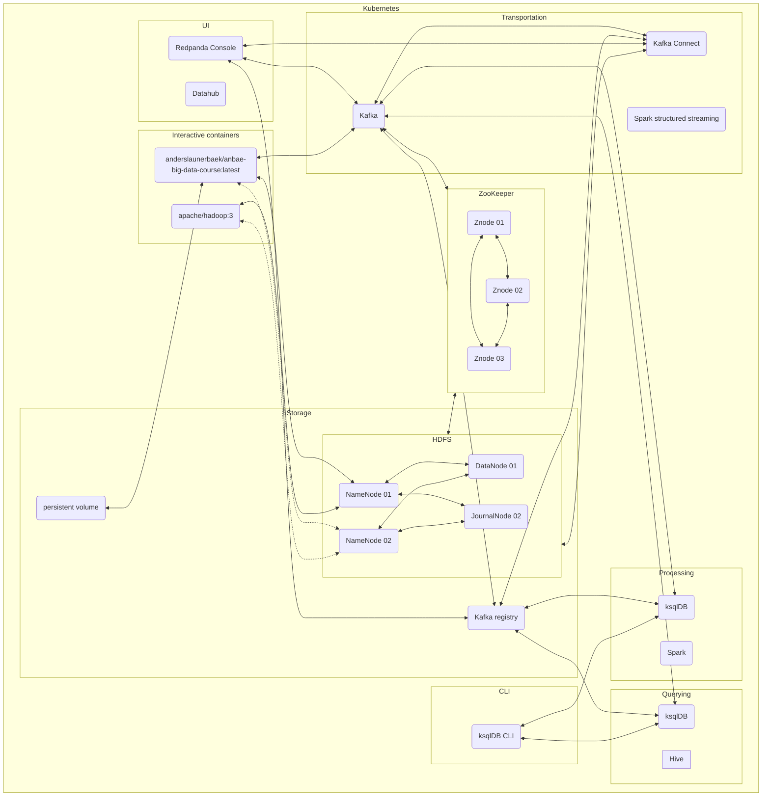

# Big data and data science technologies course exercises
This repository contains the exercises related to the course [Big data and data science technologies](https://odin.sdu.dk/sitecore/index.php?a=fagbesk&id=81974&lang=en) at University of Southern Denmark.

## Instructors
This year instructors completed the course last year (E22) and will be facilitating and responsible for the exercises.  

Nicklas Marc Pedersen and Anders Launer Bæk-Petersen will be available on Discord channel for this course and any kind of feedback is more than welcome.

## Objective

The objective of the exercises is to navigate you through the practical aspects of the curriculum. The diagram below illustrates the technology stack and frameworks that will be used during this semester. 
We have this semester chosen to transition from a docker compose orchestrator to Kubernetes to minimize the gap between a single host system to a multi-node system. 

The diagram will be updated iteratively along with the progress of the course.




## Virtual machines at SDU
Virtual machines is available for this cource. Please get further material about the virtual machines at SDU [here](./services/virtual%20machines/README.md).

## Content of the repository
The root of this repository will be related to the content of the current semester and the folder `archive` will contain material for the previous semester. The `lectures` folder and `services` folder contain the exercise material for the current semester. 

```
.
├── LICENSE
├── README.md
├── archive
│   └── E22
├── lectures
│   └── {01,02,03,...}
│       ├── ...
│       └── exercises.md
└── services
    ├── README.md
    ├── datahub
    │   └── README.md
    ├── hdfs
    │   ├── ... 
    │   └── README.md
    ├── hive
    │   └── README.md
    ├── interactive
    │   ├── ...
    │   └── README.md
    └── kafka-connect
        ├── ...
        └── README.md
```
