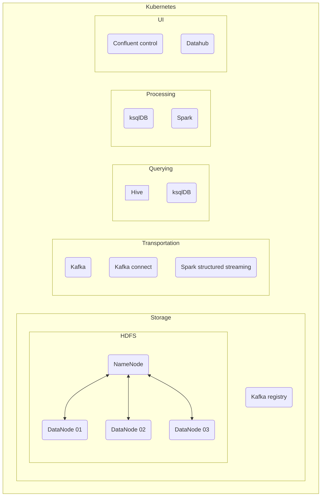

# Big data and data science technologies course exercises
This repository contains the exercises related to the course [Big data and data science technologies](https://odin.sdu.dk/sitecore/index.php?a=fagbesk&id=81974&lang=en) at University of Southern Denmark.


## Objective

WIP



## Content of the repository
The root of this repository will be related to the content of the current semester and the folder `archive` will contain material for the previous semester.

```
.
├── LICENSE
├── README.md
├── archive
│   └── E22
├── lectures
│   └── {01,02,03,...}
│       ├── README.md
│       └── content
│           └── {01,02,03,...}-exercise.md
└── services
    ├── README.md
    ├── datahub
    │   └── README.md
    ├── hdfs
    │   └── README.md
    ├── hive
    │   └── README.md
    ├── kafka
    │   └── README.md
    └── spark
        └── README.md
```